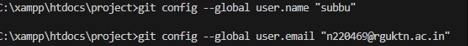
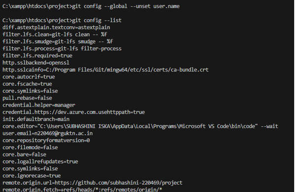
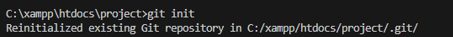
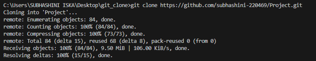

# Industry-Level Git & GitHub Commands Practice

## 1. Git Configuration Commands

### `git config --global user.name`
- **Syntax**: `git config --global user.name "<your-name>"`
- **Purpose**: Sets the author name to be used for all commits in the current system.
- **Example**: `git config --global user.name "John Doe"`
- **Screenshot proof**: 

### `git config --global user.email`
- **Syntax**: `git config --global user.email "<your-email>"`
- **Purpose**: Sets the author email to be used for all commits in the current system.
- **Example**: `git config --global user.email "johndoe@example.com"`
- **Screenshot proof**: 

### `git config --list`
- **Syntax**: `git config --list`
- **Purpose**: Displays all Git configuration settings including user info and aliases.
- **Example**: `git config --list`
- **Screenshot proof**: 

### `git config --unset`
- **Syntax**: `git config --unset <key>`
- **Purpose**: Removes a specific configuration variable from the Git settings.
- **Example**: `git config --global --unset user.name`
- **Screenshot proof**: 

## 2. Repository Setup Commands

### `git init`
- **Syntax**: `git init`
- **Purpose**: Initializes a brand new Git repository in the current directory.
- **Example**: `git init`
- **Screenshot proof**: 

### `git clone`
- **Syntax**: `git clone <repository-url>`
- **Purpose**: Creates a local copy of a remote repository.
- **Example**: `git clone https://github.com/subhashini-220469/Project.git`
- **Screenshot proof**: 

### `git clone --branch`
- **Syntax**: `git clone --branch <branch-name> <repository-url>`
- **Purpose**: Clones a repository and automatically checks out a specific branch instead of the default branch.
- **Example**: `git clone --branch dev-branch https://github.com/subhashini-220469/Project.git`
- **Screenshot proof**: *(Add screenshot here)*

### `git clone --depth`
- **Syntax**: `git clone --depth <number> <repository-url>`
- **Purpose**: Performs a "shallow" clone that only downloads a specified number of recent commits, saving time and disk space.
- **Example**: `git clone --depth 1 https://github.com/subhashini-220469/Project.git`
- **Screenshot proof**: *(Add screenshot here)*

## 3. Repository Status & Inspection

### `git status`
- **Syntax**: `git status`
- **Purpose**: Displays the current status of the working directory and staging area, showing untracked, modified, or staged files.
- **Example**: `git status`
- **Screenshot proof**: *(Add screenshot here)*

### `git log`
- **Syntax**: `git log`
- **Purpose**: Shows the commit history for the currently active branch.
- **Example**: `git log`
- **Screenshot proof**: *(Add screenshot here)*

### `git log --oneline`
- **Syntax**: `git log --oneline`
- **Purpose**: Displays the commit history in a condensed format, with one commit per line.
- **Example**: `git log --oneline`
- **Screenshot proof**: *(Add screenshot here)*

### `git log --graph`
- **Syntax**: `git log --graph`
- **Purpose**: Displays a text-based graphical representation of the commit history, helpful for visualizing branches and merges.
- **Example**: `git log --graph --oneline --all`
- **Screenshot proof**: *(Add screenshot here)*

### `git show`
- **Syntax**: `git show <commit-hash>`
- **Purpose**: Shows the metadata and content changes (diff) of a specific commit.
- **Example**: `git show a1b2c3d`
- **Screenshot proof**: *(Add screenshot here)*

### `git diff`
- **Syntax**: `git diff`
- **Purpose**: Shows the differences between the working directory and the index (staging area).
- **Example**: `git diff`
- **Screenshot proof**: *(Add screenshot here)*

### `git diff --staged`
- **Syntax**: `git diff --staged`
- **Purpose**: Displays the differences between the staged changes and the last commit.
- **Example**: `git diff --staged`
- **Screenshot proof**: *(Add screenshot here)*

### `git blame`
- **Syntax**: `git blame <file>`
- **Purpose**: Shows what revision and author last modified each line of a file.
- **Example**: `git blame index.html`
- **Screenshot proof**: *(Add screenshot here)*

### `git reflog`
- **Syntax**: `git reflog`
- **Purpose**: Records all updates to the tip of branches (HEAD), useful for recovering lost commits.
- **Example**: `git reflog`
- **Screenshot proof**: *(Add screenshot here)*

### `git shortlog`
- **Syntax**: `git shortlog`
- **Purpose**: Summarizes `git log` output, grouping commits by author.
- **Example**: `git shortlog -sn`
- **Screenshot proof**: *(Add screenshot here)*

## 4. File Tracking Commands

### `git add`
- **Syntax**: `git add <file>`
- **Purpose**: Adds specific files from the working directory to the staging area.
- **Example**: `git add index.html`
- **Screenshot proof**: *(Add screenshot here)*

### `git add .`
- **Syntax**: `git add .`
- **Purpose**: Stages all modified, deleted, and untracked files in the current directory and its subdirectories.
- **Example**: `git add .`
- **Screenshot proof**: *(Add screenshot here)*

### `git add -p`
- **Syntax**: `git add -p`
- **Purpose**: Interactively allows you to review and stage specific "hunks" (chunks) of changes within files.
- **Example**: `git add -p`
- **Screenshot proof**: *(Add screenshot here)*

### `git restore`
- **Syntax**: `git restore <file>`
- **Purpose**: Discards changes in the working directory, restoring a file to its state in the last commit.
- **Example**: `git restore index.html`
- **Screenshot proof**: *(Add screenshot here)*

### `git restore --staged`
- **Syntax**: `git restore --staged <file>`
- **Purpose**: Unstages a previously staged file, moving it back to the working directory without losing modifications.
- **Example**: `git restore --staged index.html`
- **Screenshot proof**: *(Add screenshot here)*

### `git rm`
- **Syntax**: `git rm <file>`
- **Purpose**: Removes a file from the repository (both working directory and index) and stages the deletion.
- **Example**: `git rm outdated.txt`
- **Screenshot proof**: *(Add screenshot here)*

### `git mv`
- **Syntax**: `git mv <old-name> <new-name>`
- **Purpose**: Renames or moves a file or directory and stages the change.
- **Example**: `git mv old.txt new.txt`
- **Screenshot proof**: *(Add screenshot here)*

## 5. Commit Commands

### `git commit`
- **Syntax**: `git commit`
- **Purpose**: Records atmospheric snapshot of the staging area into the repository's history and opens a text editor to write a multi-line commit message.
- **Example**: `git commit`
- **Screenshot proof**: *(Add screenshot here)*

### `git commit -m`
- **Syntax**: `git commit -m "<message>"`
- **Purpose**: Commits the staged snapshot with an inline message, bypassing the text editor.
- **Example**: `git commit -m "Initial commit"`
- **Screenshot proof**: *(Add screenshot here)*

### `git commit --amend`
- **Syntax**: `git commit --amend`
- **Purpose**: Modifies the most recent commit, typically used to change the commit message or add forgotten files.
- **Example**: `git commit --amend -m "Updated commit message"`
- **Screenshot proof**: *(Add screenshot here)*

### `git commit --no-edit`
- **Syntax**: `git commit --amend --no-edit`
- **Purpose**: Amends the last commit to include new staged changes without modifying the existing commit message.
- **Example**: `git add missing-file.txt && git commit --amend --no-edit`
- **Screenshot proof**: *(Add screenshot here)*

## 6. Branch Management Commands

### `git branch`
- **Syntax**: `git branch`
- **Purpose**: Lists all local branches in the current repository.
- **Example**: `git branch`
- **Screenshot proof**: *(Add screenshot here)*

### `git branch -a`
- **Syntax**: `git branch -a`
- **Purpose**: Lists all local and remote-tracking branches.
- **Example**: `git branch -a`
- **Screenshot proof**: *(Add screenshot here)*

### `git branch -d`
- **Syntax**: `git branch -d <branch-name>`
- **Purpose**: Safely deletes a local branch. It prevents deletion if there are unmerged changes.
- **Example**: `git branch -d feature-login`
- **Screenshot proof**: *(Add screenshot here)*

### `git branch -D`
- **Syntax**: `git branch -D <branch-name>`
- **Purpose**: Force deletes a local branch, ignoring unmerged changes.
- **Example**: `git branch -D broken-feature`
- **Screenshot proof**: *(Add screenshot here)*

### `git checkout`
- **Syntax**: `git checkout <branch-name>`
- **Purpose**: Switches the active working directory to a specified branch.
- **Example**: `git checkout main`
- **Screenshot proof**: *(Add screenshot here)*

### `git checkout -b`
- **Syntax**: `git checkout -b <new-branch>`
- **Purpose**: Creates a new branch and immediately switches to it.
- **Example**: `git checkout -b feature-dashboard`
- **Screenshot proof**: *(Add screenshot here)*

### `git switch`
- **Syntax**: `git switch <branch>`
- **Purpose**: Switches to a specified branch (a newer, more direct alternative to checkout for branching).
- **Example**: `git switch main`
- **Screenshot proof**: *(Add screenshot here)*

### `git switch -c`
- **Syntax**: `git switch -c <new-branch>`
- **Purpose**: Creates and switches to a completely new branch.
- **Example**: `git switch -c hotfix`
- **Screenshot proof**: *(Add screenshot here)*

## 7. Merge & Integration Commands

### `git merge`
- **Syntax**: `git merge <branch>`
- **Purpose**: Integrates the history of a specified branch into the currently active branch.
- **Example**: `git merge feature-login`
- **Screenshot proof**: *(Add screenshot here)*

### `git merge --no-ff`
- **Syntax**: `git merge --no-ff <branch>`
- **Purpose**: Forces git to create a merge commit, even if a fast-forward merge is possible. Retains history of the branch existence.
- **Example**: `git merge --no-ff feature-branch`
- **Screenshot proof**: *(Add screenshot here)*

## 8. Remote Repository Commands

### `git remote`
- **Syntax**: `git remote`
- **Purpose**: Lists the shortnames of each remote repository connection you have specified.
- **Example**: `git remote`
- **Screenshot proof**: *(Add screenshot here)*

### `git remote -v`
- **Syntax**: `git remote -v`
- **Purpose**: Lists the URLs of the predefined remote connections.
- **Example**: `git remote -v`
- **Screenshot proof**: *(Add screenshot here)*

### `git remote add`
- **Syntax**: `git remote add <name> <url>`
- **Purpose**: Adds a new remote repository connection.
- **Example**: `git remote add origin https://github.com/user/repo.git`
- **Screenshot proof**: *(Add screenshot here)*

### `git remote remove`
- **Syntax**: `git remote remove <name>`
- **Purpose**: Removes a remote repository connection from tracking.
- **Example**: `git remote remove upstream`
- **Screenshot proof**: *(Add screenshot here)*

### `git fetch`
- **Syntax**: `git fetch <remote>`
- **Purpose**: Downloads commits, files, and refs from a remote repository without integrating them into the local branch.
- **Example**: `git fetch origin`
- **Screenshot proof**: *(Add screenshot here)*

### `git fetch --all`
- **Syntax**: `git fetch --all`
- **Purpose**: Fetches updates from all configured remote repositories.
- **Example**: `git fetch --all`
- **Screenshot proof**: *(Add screenshot here)*

### `git pull`
- **Syntax**: `git pull <remote> <branch>`
- **Purpose**: Fetches changes from a remote repository and immediately attempts to merge them into the current branch.
- **Example**: `git pull origin main`
- **Screenshot proof**: *(Add screenshot here)*

### `git pull --rebase`
- **Syntax**: `git pull --rebase <remote> <branch>`
- **Purpose**: Fetches changes and then applies local commits on top of the fetched updates, avoiding arbitrary merge commits and keeping history linear.
- **Example**: `git pull --rebase origin main`
- **Screenshot proof**: *(Add screenshot here)*

### `git push`
- **Syntax**: `git push <remote> <branch>`
- **Purpose**: Uploads local repository content to a remote repository.
- **Example**: `git push origin main`
- **Screenshot proof**: *(Add screenshot here)*

### `git push -u origin branch-name`
- **Syntax**: `git push -u origin <branch>`
- **Purpose**: Pushes a local branch and sets upstream tracking, meaning future "git push" commands won't require specifying the remote and branch.
- **Example**: `git push -u origin feature-branch`
- **Screenshot proof**: *(Add screenshot here)*

### `git push --force`
- **Syntax**: `git push --force <remote> <branch>`
- **Purpose**: Forces a push to a remote repository, overwriting history on the remote if it conflicts with the local. (Use with caution).
- **Example**: `git push --force origin main`
- **Screenshot proof**: *(Add screenshot here)*

## 9. Stash Commands

### `git stash`
- **Syntax**: `git stash`
- **Purpose**: Temporarily shelves (stashes) uncommitted changes in the working directory, leaving a clean state.
- **Example**: `git stash`
- **Screenshot proof**: *(Add screenshot here)*

### `git stash list`
- **Syntax**: `git stash list`
- **Purpose**: Displays all stashed changes available.
- **Example**: `git stash list`
- **Screenshot proof**: *(Add screenshot here)*

### `git stash pop`
- **Syntax**: `git stash pop`
- **Purpose**: Applies the most recently stashed changes back into the working directory and removes them from the stash list.
- **Example**: `git stash pop`
- **Screenshot proof**: *(Add screenshot here)*

### `git stash apply`
- **Syntax**: `git stash apply`
- **Purpose**: Applies stashed changes to the working directory, but keeps the stash entry intact.
- **Example**: `git stash apply`
- **Screenshot proof**: *(Add screenshot here)*

### `git stash drop`
- **Syntax**: `git stash drop`
- **Purpose**: Deletes a specific stash from the stash list.
- **Example**: `git stash drop stash@{0}`
- **Screenshot proof**: *(Add screenshot here)*

### `git stash clear`
- **Syntax**: `git stash clear`
- **Purpose**: Removes all entries from the stash list.
- **Example**: `git stash clear`
- **Screenshot proof**: *(Add screenshot here)*

## 10. Reset & Undo Commands

### `git reset`
- **Syntax**: `git reset <commit>`
- **Purpose**: Resets current HEAD to the specified state, moving history back but keeping untracked workspace files unchanged.
- **Example**: `git reset HEAD~1`
- **Screenshot proof**: *(Add screenshot here)*

### `git reset --soft`
- **Syntax**: `git reset --soft <commit>`
- **Purpose**: Moves HEAD back but keeps changes in the index and working directory, effectively undoing a commit while keeping files staged for the next commit.
- **Example**: `git reset --soft HEAD~1`
- **Screenshot proof**: *(Add screenshot here)*

### `git reset --mixed`
- **Syntax**: `git reset --mixed <commit>`
- **Purpose**: The default reset. Moves HEAD and unstages changes, keeping modifications in the working directory.
- **Example**: `git reset --mixed HEAD~1`
- **Screenshot proof**: *(Add screenshot here)*

### `git reset --hard`
- **Syntax**: `git reset --hard <commit>`
- **Purpose**: Reverts working directory, staging area, and HEAD completely to a previous state, losing uncommitted changes irrevocably.
- **Example**: `git reset --hard a1b2c3d`
- **Screenshot proof**: *(Add screenshot here)*

### `git revert`
- **Syntax**: `git revert <commit>`
- **Purpose**: Creates a completely new commit that reverses the changes of a specified previous commit, preserving project history.
- **Example**: `git revert a1b2c3d`
- **Screenshot proof**: *(Add screenshot here)*

### `git clean -f`
- **Syntax**: `git clean -f`
- **Purpose**: Forcefully removes untracked files from the current working directory.
- **Example**: `git clean -f`
- **Screenshot proof**: *(Add screenshot here)*

### `git clean -fd`
- **Syntax**: `git clean -fd`
- **Purpose**: Formats and removes both untracked files and untracked directories.
- **Example**: `git clean -fd`
- **Screenshot proof**: *(Add screenshot here)*

## 11. Rebasing Commands

### `git rebase`
- **Syntax**: `git rebase <base-branch>`
- **Purpose**: Applies commits from the current branch linearly onto the tip of another branch, smoothing project history.
- **Example**: `git rebase main`
- **Screenshot proof**: *(Add screenshot here)*

### `git rebase -i`
- **Syntax**: `git rebase -i <commit>`
- **Purpose**: Interactively allows compressing, editing, reordering, dropping or modifying commits before they get rebased.
- **Example**: `git rebase -i HEAD~3`
- **Screenshot proof**: *(Add screenshot here)*

### `git rebase --continue`
- **Syntax**: `git rebase --continue`
- **Purpose**: Resumes a rebase process once merge conflicts are manually resolved.
- **Example**: `git add . && git rebase --continue`
- **Screenshot proof**: *(Add screenshot here)*

### `git rebase --abort`
- **Syntax**: `git rebase --abort`
- **Purpose**: Stops a rebasing process midway and restores the branch original state.
- **Example**: `git rebase --abort`
- **Screenshot proof**: *(Add screenshot here)*

## 12. Cherry Pick & Patch Commands

### `git cherry-pick`
- **Syntax**: `git cherry-pick <commit-hash>`
- **Purpose**: Picks a specific commit from one branch and applies its changes as a new commit onto the current working branch.
- **Example**: `git cherry-pick a1b2c3d`
- **Screenshot proof**: *(Add screenshot here)*

### `git format-patch`
- **Syntax**: `git format-patch <commit-range>`
- **Purpose**: Converts a series of commits into patch files meant to be shared via email or otherwise.
- **Example**: `git format-patch -1 HEAD`
- **Screenshot proof**: *(Add screenshot here)*

### `git apply`
- **Syntax**: `git apply <patch-file>`
- **Purpose**: Reapplies changes laid out in a patch file to your working directory, without creating commits.
- **Example**: `git apply 0001-fix-bug.patch`
- **Screenshot proof**: *(Add screenshot here)*

### `git am`
- **Syntax**: `git am <patch-file>`
- **Purpose**: Reapplies changes generated by format-patch to your project while also automatically turning them into commits.
- **Example**: `git am 0001-fix-bug.patch`
- **Screenshot proof**: *(Add screenshot here)*

## 13. Tagging Commands

### `git tag`
- **Syntax**: `git tag`
- **Purpose**: Lists all available tags in the repository.
- **Example**: `git tag`
- **Screenshot proof**: *(Add screenshot here)*

### `git tag -a`
- **Syntax**: `git tag -a <tag-name> -m "<message>"`
- **Purpose**: Creates an annotated tag, which includes author info, date, and a message explicitly meant for releases.
- **Example**: `git tag -a v1.0 -m "Release version 1.0"`
- **Screenshot proof**: *(Add screenshot here)*

### `git tag -d`
- **Syntax**: `git tag -d <tag-name>`
- **Purpose**: Deletes an existing local tag.
- **Example**: `git tag -d v1.0`
- **Screenshot proof**: *(Add screenshot here)*

### `git push origin --tags`
- **Syntax**: `git push origin --tags`
- **Purpose**: Pushes all locally created tags to the remote GitHub repository.
- **Example**: `git push origin --tags`
- **Screenshot proof**: *(Add screenshot here)*

## 14. Submodule Commands

### `git submodule add`
- **Syntax**: `git submodule add <repository-url> <path>`
- **Purpose**: Embeds an external Git repository into a specific subdirectory within your project.
- **Example**: `git submodule add https://github.com/example/library.git libs/library`
- **Screenshot proof**: *(Add screenshot here)*

### `git submodule init`
- **Syntax**: `git submodule init`
- **Purpose**: Initializes submodules newly pulled down to a given environment, setting configuration variables.
- **Example**: `git submodule init`
- **Screenshot proof**: *(Add screenshot here)*

### `git submodule update`
- **Syntax**: `git submodule update`
- **Purpose**: Fetches all the data and checks out the specific commits laid out in the parent repository for a module.
- **Example**: `git submodule update`
- **Screenshot proof**: *(Add screenshot here)*

## 15. Debugging Commands

### `git bisect`
- **Syntax**: `git bisect`
- **Purpose**: A command interface used to perform binary search on project commits to find when a specific bug was introduced.
- **Example**: `git bisect`
- **Screenshot proof**: *(Add screenshot here)*

### `git bisect start`
- **Syntax**: `git bisect start`
- **Purpose**: Initializes the binary search process for finding a bug.
- **Example**: `git bisect start`
- **Screenshot proof**: *(Add screenshot here)*

### `git bisect good`
- **Syntax**: `git bisect good <commit>`
- **Purpose**: Marks a specific commit as "good" meaning the bug wasn't present at this point.
- **Example**: `git bisect good v1.0`
- **Screenshot proof**: *(Add screenshot here)*

### `git bisect bad`
- **Syntax**: `git bisect bad <commit>`
- **Purpose**: Marks a specific commit as "bad" signaling the bug is present at that state.
- **Example**: `git bisect bad HEAD`
- **Screenshot proof**: *(Add screenshot here)*

---

## Step 3: GitHub Features to Demonstrate
*Provide screenshot or brief written proof confirming completion:*

- **Create repository**: *(Add screenshot here)*
- **Add README**: *(Add screenshot here)*
- **Add .gitignore**: *(Add screenshot here)*
- **Create issue**: *(Add screenshot here)*
- **Assign issue**: *(Add screenshot here)*
- **Create branch**: *(Add screenshot here)*
- **Push branch**: *(Add screenshot here)*
- **Create pull request**: *(Add screenshot here)*
- **Review pull request**: *(Add screenshot here)*
- **Merge pull request**: *(Add screenshot here)*
- **Resolve merge conflict**: *(Add screenshot here)*
- **Close issue**: *(Add screenshot here)*
- **Add labels**: *(Add screenshot here)*
- **Add collaborators**: *(Add screenshot here)*
